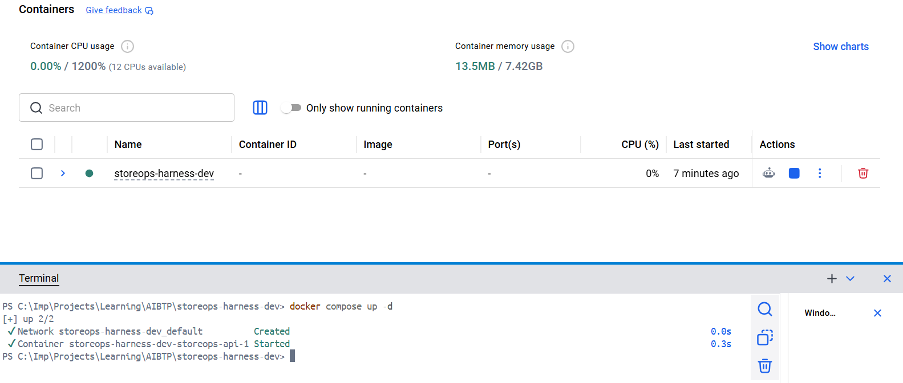
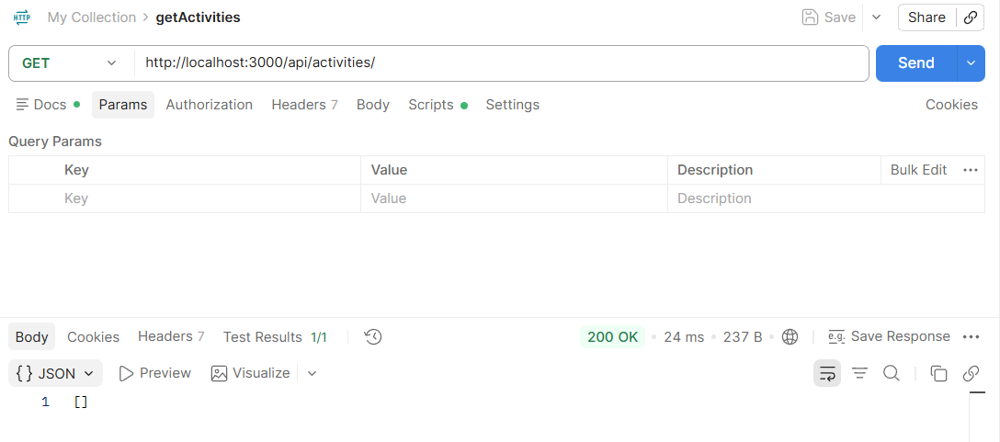
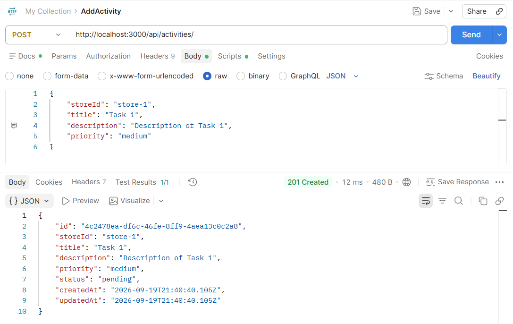
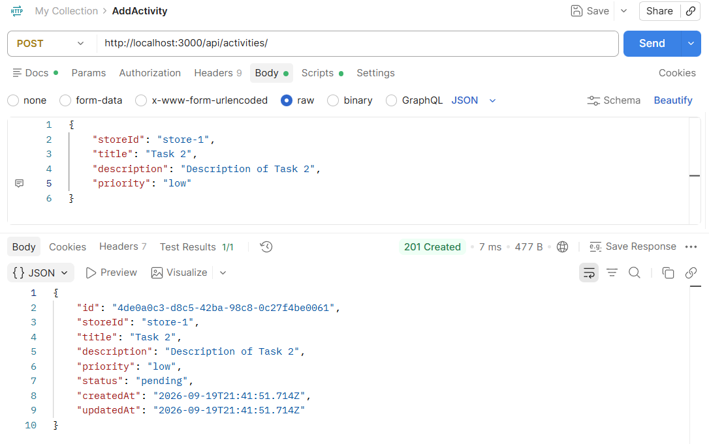
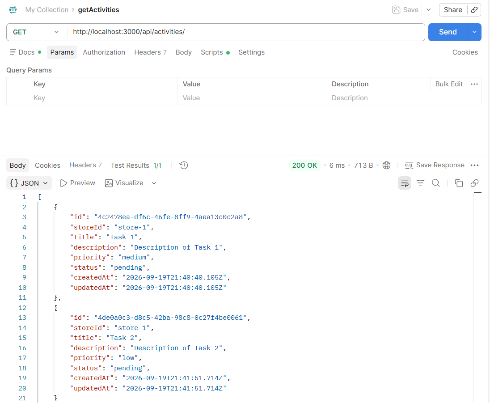
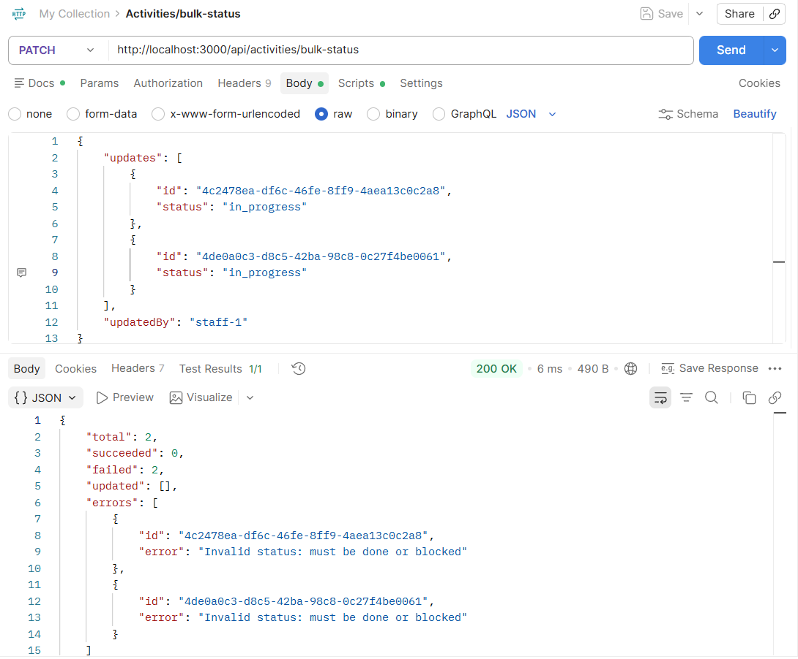
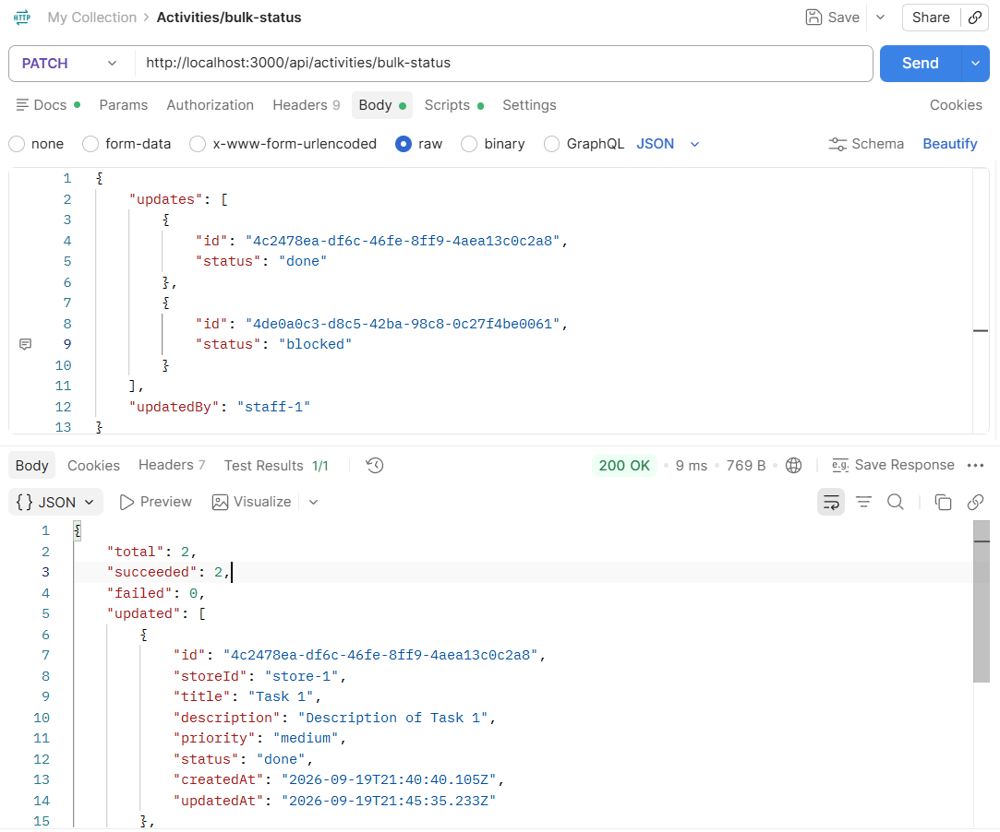
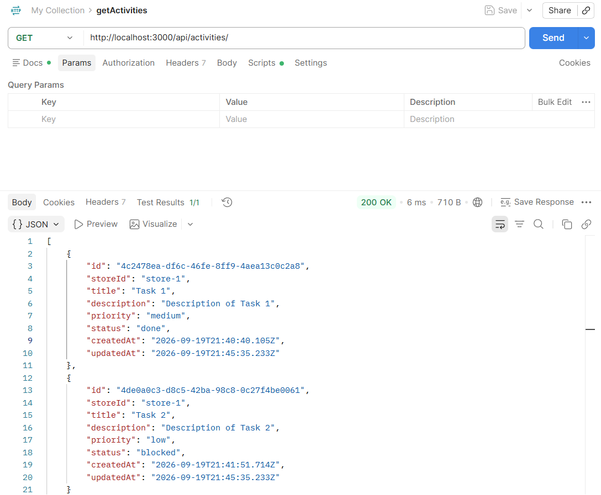

## Deployment Target

**Environment:** Local Docker container

**Image:** Built from the project `Dockerfile` using `npm run build` output

**Port:** 3000 (mapped from container port 3000)

## Steps Taken

1. Containerised the application
2. Ran `docker compose up -d` - to start the container
3. Verified the app was running by hitting `GET /api/activities` (empty list response)
4. Added 2 sample tasks by calling — `POST /api/activities/` — twice with different task details
5. Exercised the Sprint 1 feature — `PATCH /api/activities/bulk-status` — against the running container, capturing screenshots of error and success scenarios

---

## Screenshots showing the new endpoint responding in the running application:
Running the app in docker container:

Initial blank get activities call:

Adding Task 1:

Adding Task 2:

Getting list of activities with Task 1 and Task 2 pending:

Bulk status error scenario (the status is not done or blocked)

Bulk status success scenario: update Task 1 (to done) and Task 2 (to blocked)

Getting list of activities with Task 1 done and Task 2 blocked:

