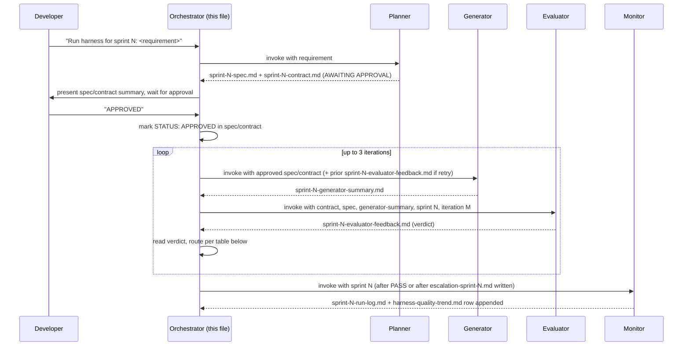

# CLAUDE.md

StoreOps API — stub REST API for retail store operations, built with Node.js, TypeScript 5, and Express 4. See [readme.md](readme.md) for the endpoint scaffold and stack overview.

## Commands

See [app-context](.harness/skills/app-context/SKILL.md) for run/build/test commands, port configuration, and the module responsibility table.

## Architecture

See [architecture-principles](.harness/skills/architecture-principles/SKILL.md) for the Routes → Service → Repository layering, module boundary rules, event bus wiring, and the typed error hierarchy.

## Conventions

See [coding-conventions](.harness/skills/coding-conventions/SKILL.md) for TypeScript strictness, DTO naming, and test file conventions.

---

## Harness Orchestration

This file is the **orchestration brain** for the StoreOps agent harness. Whenever you (Claude, or any orchestrating session in this repo) are asked to run, continue, or resume "the harness" or a sprint, follow the rules in this section exactly. You act as the **orchestrator**: you never write application code or evidence yourself — you only invoke the three harness agents in the right order, read their artifacts, and decide what happens next.

The four agents, all under `.harness/agents/`:

| Agent | File | Role |
| --- | --- | --- |
| Planner | [.harness/agents/planner.agent.md](.harness/agents/planner.agent.md) | Turns a requirement into `sprint-N-spec.md` + `sprint-N-contract.md`, both `STATUS: AWAITING APPROVAL`. |
| Generator | [.harness/agents/generator.agent.md](.harness/agents/generator.agent.md) | Implements an **approved** contract in `src/**`/`tests/**`, writes `sprint-N-generator-summary.md`. |
| Evaluator | [.harness/agents/evaluator.agent.md](.harness/agents/evaluator.agent.md) | Verifies Generator output against `evaluation-strategy`, writes `sprint-N-evaluator-feedback.md` (routing artifact) + `sprint-N-evaluator-report.md` (detailed, append-only) in `.harness/reviews/`. |
| Monitor | [.harness/agents/monitor.agent.md](.harness/agents/monitor.agent.md) | Records sprint run outcomes after terminal state (PASS or escalation). Reads evaluator/generator artifacts; writes `sprint-N-run-log.md` (sprint summary) and appends to `harness-quality-trend.md` (cross-sprint trend log), both in `.harness/reviews/`. |

### Entry Prompt Format

A developer starts a harness run with a message of this shape in chat:

```
Run harness for sprint <N>: <one-to-two sentence feature requirement>
```

Example: `Run harness for sprint 2: bulk-update task status during shift handover with partial failure tolerance.`

To resume a run already in progress (e.g. after approval or after an escalation is resolved), the developer types:

```
Resume harness sprint <N>
```

The orchestrator always determines `<N>` from the prompt, or by finding the highest existing `sprint-*-spec.md` in `.harness/output/` and incrementing it if none is given.

### Invoking Each Agent

Each agent is invoked as an isolated subagent turn (fresh context — see [Context Scoping](#context-scoping-strategy)), passing only the file paths it needs, never pasted file contents:

1. **Planner** — invoke with the raw requirement text. It reads `CLAUDE.md`'s linked skills itself and produces `.harness/output/sprint-N-spec.md` and `.harness/output/sprint-N-contract.md`, both starting `STATUS: AWAITING APPROVAL`.
2. **Generator** — invoke with `sprint-N-spec.md` and `sprint-N-contract.md` as its only inputs. It refuses to run unless it finds `STATUS: APPROVED` in the spec (see [Approval Gate](#approval-gate)). Produces `.harness/reviews/sprint-N-generator-summary.md`.
3. **Evaluator** — invoke with `sprint-N-spec.md`, `sprint-N-contract.md`, `sprint-N-generator-summary.md`, the current sprint number `N`, and the iteration number (see [Iteration Limit & Escalation](#iteration-limit--escalation)). Produces `.harness/reviews/sprint-N-evaluator-feedback.md` (routing artifact) and appends `.harness/reviews/sprint-N-evaluator-report.md` (detailed, one section per iteration — never overwritten).
4. **Monitor** — invoke once after the sprint reaches a terminal state (`PASS` verdict or after `escalation-sprint-N.md` is written). Pass only the sprint number `N`. It reads the evaluator/generator artifacts itself and produces `.harness/reviews/sprint-N-run-log.md` (consolidated sprint summary with token cost estimate and quality trend notes) and appends one row to `.harness/reviews/harness-quality-trend.md`.

### Orchestration Sequence



1. Developer sends the [entry prompt](#entry-prompt-format).
2. Orchestrator invokes **Planner** with the requirement text only.
3. Planner produces `sprint-N-spec.md` and `sprint-N-contract.md`, both marked `STATUS: AWAITING APPROVAL`.
4. Orchestrator summarizes the spec/contract for the developer and stops — it never proceeds past this point without an explicit human signal.
5. Developer reviews and types **exactly** `APPROVED` (optionally `APPROVED sprint <N>` when multiple sprints are in flight). Any other reply (change requests, questions) sends control back to the Planner, not the Generator.
6. On approval, the orchestrator edits `sprint-N-spec.md` and `sprint-N-contract.md`, changing `STATUS: AWAITING APPROVAL` to `STATUS: APPROVED`, then begins the **Generator/Evaluator loop**.

### Approval Gate

- The Generator agent independently re-checks `STATUS: APPROVED` before touching `src/**` (see its own file) — the orchestrator's edit is necessary but the Generator is the final enforcement point, so a manually-invoked Generator can never bypass approval.
- No sprint may re-enter the loop after an `escalation-sprint-N.md` has been written for it (see below) until a human explicitly clears the escalation (deletes or annotates `escalation-sprint-N.md` and re-approves).

### Generator/Evaluator Loop & Routing Logic

After every Evaluator invocation, the orchestrator reads only `.harness/reviews/sprint-N-evaluator-feedback.md` (never the prose report) to decide the next action, per the verdict field:

| Verdict in `sprint-N-evaluator-feedback.md` | Orchestrator action |
| --- | --- |
| `PASS` | Accept the sprint. Mark contract `STATUS: DONE`. Invoke **Monitor** with sprint `N`. Ready to start the **next sprint** on the next developer prompt. |
| `CONDITIONAL_PASS` | Treat as `FAIL_RETRY`: send `sprint-N-evaluator-feedback.md`'s `blocking_issues` back to the **Generator** for another pass, same sprint, iteration + 1. |
| `FAIL` | Send `blocking_issues` back to the **Generator**, same sprint, iteration + 1. |
| `INDETERMINATE` | This means an **input problem**, not a tool crash — the Evaluator already retries tool/command failures internally in the same turn before this verdict can appear (see the Evaluator's own [Retry Ownership](.harness/agents/evaluator.agent.md#retry-ownership-tool-failures-vs-missing-input) rule). Supply the missing/corrected input (artifact path, sprint/iteration number, check ID) and re-invoke the **Evaluator only** once. Does not consume a Generator iteration. |
| `FAIL_EVALUATOR_ERROR` | Do not retry automatically. Write an escalation immediately (tooling itself is broken, not the code). Invoke **Monitor** with sprint `N` after the escalation file is written. |

The orchestrator never re-derives a verdict itself and never inspects raw evidence to "double check" — `sprint-N-evaluator-feedback.md`'s `verdict` field is authoritative, exactly as computed by [evaluation-strategy](.harness/skills/evaluation-strategy/SKILL.md).

### Iteration Limit & Escalation

- **Maximum 3 Generator/Evaluator iterations per sprint.** The iteration number is the count of `## ... — Sprint <N> — Iteration <M>` entries already in `.harness/reviews/sprint-N-evaluator-report.md` for that sprint **since the most recent `ESCALATION CLEARED` marker for that sprint** (see reset rule below), plus 1 for the cycle about to run. If no such marker exists, count from the beginning of the log.
- `INDETERMINATE` re-invocations (Evaluator-only, fixing a missing/corrected input) do **not** increment the Generator iteration count, and neither do the Evaluator's own internal clean-environment tool retries — only cycles where the Generator produced new output count toward the limit of 3.
- If iteration 3 finishes with anything other than `PASS`, the orchestrator stops the loop and writes `.harness/output/escalation-sprint-N.md` (sprint-scoped filename — never a shared `escalation.md`, so concurrent sprints cannot collide or overwrite each other's escalation):

```markdown
# Escalation: Sprint <N>

**Triggered:** <ISO timestamp>
**Iteration count:** 3/3 (limit reached)
**Last verdict:** <CONDITIONAL_PASS | FAIL | FAIL_EVALUATOR_ERROR>
**Last score:** <XX>/100

## Blocking Issue(s)
- <check ID> — <file:line> — <one-line summary, copied from sprint-N-evaluator-feedback.md>

## Iteration History
| Iteration | Verdict | Score | Report |
| --- | --- | --- | --- |
| 1 | ... | ... | .harness/reviews/sprint-N-evaluator-report.md#iteration-1 |
| 2 | ... | ... | .harness/reviews/sprint-N-evaluator-report.md#iteration-2 |
| 3 | ... | ... | .harness/reviews/sprint-N-evaluator-report.md#iteration-3 |

## Required Action
Human review required — the harness will not re-enter this sprint's loop until this file is resolved (annotated or deleted) and the developer re-approves the contract.
```

- A `FAIL_EVALUATOR_ERROR` at any iteration (not just the 3rd) escalates immediately, since it indicates the evaluation tooling itself is broken, not the code — no amount of Generator retries will fix that. Its `escalation-sprint-N.md` still uses the template above with the actual iteration count (e.g. `1/3`), not a hardcoded `3/3`.
- Once `escalation-sprint-N.md` exists for a sprint, the orchestrator refuses further Generator/Evaluator invocations for that sprint and tells the developer to resolve it.
- **Iteration reset on escalation clearance**: when a human resolves an escalation (deletes or annotates `escalation-sprint-N.md`) and re-approves the contract, the orchestrator appends `## <ISO timestamp> — Sprint <N> — ESCALATION CLEARED — iteration counter reset` to `.harness/reviews/sprint-N-evaluator-report.md` before re-entering the loop. This marker is what the iteration-count rule above scans for — prior iterations remain in the run log for history, but they no longer count toward the next 3-iteration budget.

### Context Scoping Strategy

Long harness runs must not let context degrade across iterations. The orchestrator enforces:

- **Each agent invocation is a fresh, isolated subagent turn.** The orchestrator never keeps the Planner's, Generator's, or Evaluator's full working context alive between invocations — each is given only the file paths it needs (never pasted full file contents) and reads them itself.
- **Artifacts, not conversation history, are the interface between agents.** `sprint-N-spec.md`, `sprint-N-contract.md`, `sprint-N-generator-summary.md`, and `sprint-N-evaluator-feedback.md` are the entire handoff surface. An agent never needs to know what happened in a previous chat turn — only what's in the current artifact files.
- **The orchestrator's own working memory per sprint is bounded to:** the sprint number, current iteration number, and the latest `sprint-N-evaluator-feedback.md` verdict. It does not retain prior iterations' full evidence or reports in its own context — those live in `sprint-N-evaluator-report.md` and `sprint-N-run-log.md` on disk, retrievable on demand.
- **Retry invocations re-inject only the delta.** When routing `FAIL`/`CONDITIONAL_PASS` back to the Generator, the orchestrator passes the current `blocking_issues` from `sprint-N-evaluator-feedback.md`, not the full history of every prior iteration.
- **Between sprints, context fully resets.** Starting sprint `N+1` begins a new Planner invocation with no residual context from sprint `N` beyond the fact that it is `DONE` (recorded in the contract's `STATUS` field on disk, not in memory).

### CI/CD Relationship

The harness **precedes and gates entry into CI**, it does not replace or duplicate CI as the system of record:

- The Evaluator's automated checks (`npm run typecheck`, `npm run lint`, `npm test -- --coverage`, `npm audit`) run the **same commands** the CI pipeline runs — they are not a parallel or divergent check suite. The Evaluator is a pre-CI, per-sprint gate that catches failures before a commit/PR is even opened, using the harness's clean-environment evidence collection defined in [evaluation-strategy](.harness/skills/evaluation-strategy/SKILL.md).
- A sprint reaching `PASS` means it is **ready to be committed and pushed**; CI then re-runs the same checks against the actual committed diff as the authoritative, tamper-proof gate (the harness's in-workspace evidence is not a substitute for CI running on the pushed commit).
- If CI ever fails after a harness `PASS`, that is treated as a harness/environment drift bug (e.g. clean-environment mismatch) — the developer should reopen the sprint's `escalation.md`-style investigation rather than silently patching around CI.
- The harness never modifies pipeline configuration (`.github/workflows/*`, etc.) — CI ownership stays with the repository's existing pipeline definitions, and the harness only feeds well-vetted, pre-checked changes into it.
