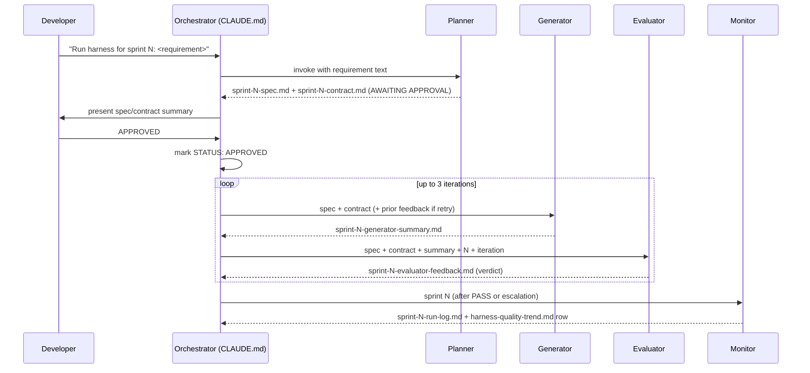

# StoreOps Harness Design Brief

**Project:** StoreOps REST API — retail store operations  
**Date:** 2026-09-19  
**Stack:** Node.js · TypeScript 5 · Express 4 · Jest · dependency-cruiser

---

## Overview

The StoreOps harness is a four-agent AI system that governs how features are planned, generated, evaluated, and observed. It sits in front of CI/CD as a pre-commit quality gate, converting an unstructured feature sentence into a version-controlled sprint artifact trail, deterministically scored evidence, and a human-readable audit log. The harness never replaces CI — it gates entry into it.



---

## Section A — Intent Decomposition

### Decomposing a Feature into Sprint Contracts

The harness treats every feature as a scope decision before it is a code decision. The Planner agent, guided by the `sprint-decomposition` skill, decomposes a raw requirement into a sprint contract whose acceptance criteria are directly exercisable as automated tests. This decomposition step is the harness's primary defence against scope creep and ambiguous implementation: if a criterion cannot be written as a GIVEN/WHEN/THEN triple, it is not sprint-ready.

Sprint boundaries are drawn along **cohesion and dependency order**, not calendar time. For Sprint 0 (the baseline REST API), all nine endpoints across `activities`, `programmes`, and `alerts` were grouped into a single sprint because they form the foundational data surface that every future sprint will depend on. There are no cross-sprint dependencies within the baseline. Had the feature included auth middleware or persistent storage, those would have formed a separate sprint whose contract would list the baseline sprint as a precondition.

```
Sprint N = the smallest set of capabilities that (a) delivers observable value,
           (b) can be specified as independently testable ACs, and
           (c) introduces no partial dependency on an unapproved future sprint.
```

### Making Acceptance Criteria Testable

Each AC follows three rules that convert a business intent into machine-verifiable evidence:

1. **GIVEN establishes a deterministic starting state** — not "when data exists" but "GIVEN a programme exists with id `prog-1`". The test can reproduce this state unconditionally.
2. **WHEN is a single, atomic action** — one HTTP call, one event, one function invocation. Multi-action WHENs become test setup that obscures which action is under test.
3. **THEN names an observable outcome** — a specific HTTP status code, a named field in the response body, a record's absence after deletion. "The system behaves correctly" is not a THEN; `status: 204` is.

The `sprint-decomposition` skill further requires covering all four condition categories per story: happy path, validation/error path, edge cases, and side effects. An AC set with only happy-path coverage is marked non-sprint-ready by the Planner and will fail the Evaluator's `D1-G3` hard gate (mandatory AC with no mapped test).

### Example Sprint Contract Entry

The following AC from Sprint 0 illustrates the programme membership feature. It demonstrates the full condition set: success, duplicate guard, missing field, and not-found — each independently testable.

```
### AC10: Add programme member — success
- GIVEN a programme exists with a known ID, and staffId "staff-1" and role "lead" are supplied
- WHEN POST /api/programmes/:id/members is called
- THEN 201 is returned with the programme body containing a members array
  where members[0] has staffId "staff-1", role "lead", and a joinedAt timestamp

### AC11: Add programme member — duplicate conflict
- GIVEN staff member "staff-dup" is already in programme prog-1
- WHEN POST /api/programmes/prog-1/members is called with staffId "staff-dup"
- THEN 409 is returned with error.code "CONFLICT"

### AC12 (Negative): Add programme member — programme not found
- GIVEN no programme exists with id "nonexistent"
- WHEN POST /api/programmes/nonexistent/members is called
- THEN 404 is returned with error.code "NOT_FOUND"
```

Each of these three criteria maps to a distinct test case. The 409 test specifically exercises the `ConflictError` path through `programmes.service.ts → programmes.repository.ts → addMember()`, covering the shared `errors.ts` `ConflictError` class — a coverage contribution that would otherwise require a standalone unit test.

---

## Section B — Governance Framework

### Skill File Strategy

The harness uses six skill files, each encoding a distinct governance concern. They are structured as Markdown documents with YAML frontmatter and consumed by agents as read-only context, never modified during a sprint run.

```
.harness/skills/
├── app-context/              ← what StoreOps IS (stack, commands, modules)
├── architecture-principles/  ← how StoreOps modules MUST relate to each other
├── add-functionality/        ← do/don't guidance for implementing endpoints and modules
├── coding-conventions/       ← how TypeScript and tests MUST be written
├── evaluation-strategy/      ← how evidence becomes a verdict (Evaluator only)
└── sprint-decomposition/     ← how requirements become ACs (Planner only)
```

| Skill | Consumed by | What it encodes that is StoreOps-specific |
| --- | --- | --- |
| `app-context` | All four agents | The five module names, their domain ownership, and the exact CLI commands (`npm run depcruise`, `npm run typecheck`, etc.) |
| `architecture-principles` | Planner, Generator, Evaluator | The Routes→Service→Repository layer order; the event-bus rule for cross-module side effects; the `no-cross-module-repository` constraint enforced by dependency-cruiser |
| `add-functionality` | Generator only | Layering do/don't rules (e.g. never mutate arrays from routes, always type constructor deps against the repository interface, never return live array references); the step-by-step checklist for wiring a new module into `src/app.ts`; an anti-pattern catalogue that complements `architecture-principles` with implementation-level specifics the Generator needs but the Planner and Evaluator do not |
| `coding-conventions` | Generator, Evaluator | TypeScript strict mode, `@typescript-eslint/no-explicit-any` as error, `Create<Entity>Input` DTO naming, test file location policy |
| `evaluation-strategy` | Evaluator only | The D1–D4 weighted scoring model, the hard gate registry, and the deterministic fallback table — not shared because other agents must not reason about verdicts |
| `sprint-decomposition` | Planner only | The four-category AC coverage rule (happy/error/edge/side-effect); anti-patterns like multi-action WHENs — not shared because decomposition is a planning concern, not an implementation or evaluation one |

The separation of `evaluation-strategy` from the Generator is intentional: if the Generator knew how it would be scored, it could optimise for the scoring rubric rather than for correct implementation. The scoring policy is an Evaluator-internal concern. Similarly, `add-functionality` is kept out of the Evaluator's context: it contains permissive implementation guidance that, if available during evaluation, could influence the Evaluator to reason about intent rather than evidence.

### The `.harness/reviews/` Archive as Governance Audit Trail

Every sprint produces a deterministic paper trail in `.harness/reviews/`:

| Artifact | Written by | Purpose |
| --- | --- | --- |
| `sprint-N-generator-summary.md` | Generator | Self-reported AC coverage, files changed, coverage metrics — treated as a claim to be verified, not as evidence |
| `sprint-N-evaluator-report.md` | Evaluator (append-only) | Check-by-check evidence with command, exit code, file:line, and verdict — one section per iteration, never overwritten |
| `sprint-N-evaluator-feedback.md` | Evaluator (overwrite) | Machine-parseable routing artifact for the orchestrator — the only file the orchestrator reads to decide next action |
| `sprint-N-run-log.md` | Monitor | Sprint-level summary with token cost estimate and iteration efficiency |
| `harness-quality-trend.md` | Monitor (append) | Cross-sprint dimension score table for drift detection |

The archive is accessible to any developer or automated process with filesystem access. A recurring quality issue surfaces through the Monitor's drift-detection logic: if the same check ID appears in `hard_gates_failed` across two or more consecutive sprints in `harness-quality-trend.md`, the Monitor flags it as a **skill-file drift signal** — an indication that the skill governing that check may be under-specified. This is the feedback loop that evolves the harness over time without requiring manual review of every report.

### The `no-cross-module-repository` Rule

**The rule** (from `.dependency-cruiser.js`, `architecture-principles` SKILL):

> A file in `src/modules/X/` may not import `src/modules/Y/*.repository.*` where `X ≠ Y`. Cross-module data access must go through the owning module's service.

**What breaks without it:** Without this constraint, a developer adding a feature to `programmes` might import `StaffRepository` directly to look up a staff member, bypassing `StaffService`. This creates two failure modes: (1) it leaks `StaffRepository`'s internal representation across a module boundary, making future refactors of the staff data model cascade into the programmes module; (2) it bypasses the validation and event-emission logic in `StaffService`, so a programmes-originated staff lookup can return data in an inconsistent state (e.g., after a soft-delete that the service knows about but the repository does not). The dependency-cruiser rule catches this at CI entry — before any human review — as a D2-G1 hard gate failure.

---

## Section C — Non-Determinism Strategy

### Evaluation Dimensions and Weights

The Evaluator applies a four-dimension scoring model defined in `evaluation-strategy` SKILL. Weights reflect the relative cost of a defect in each dimension reaching production:

| Dimension | Weight | StoreOps rationale |
| --- | --- | --- |
| D1 — Functional correctness | 35% | Incorrect behaviour in a retail ops API (wrong status codes, missing endpoints, test-state leakage) causes silent data errors in store operations |
| D2 — Architecture & governance | 30% | Module boundary violations accumulate technical debt that degrades the entire codebase, not just the sprint that introduced them |
| D3 — Type safety & maintainability | 20% | TypeScript strictness and zero-lint policy are the harness's primary defence against runtime surprises in a JS codebase |
| D4 — Security & dependency integrity | 15% | Dependency vulnerabilities in a stub API have limited attack surface now, but the habit of clean audits must be established from sprint 0 |

Weights are applied only to scored checks (`C` IDs). Hard gates (`G` IDs) carry no points — they are binary blockers.

### Hard Gates: Why Each Cannot Be a Soft Check

| Gate | Failure mode prevented | Why it cannot be soft |
| --- | --- | --- |
| D1-G1 | Jest exits non-zero | A failing test suite means the code under test is provably broken. No score threshold can compensate for a test that demonstrates a regression |
| D1-G2 | Required endpoint absent or wrong method/path | A missing or mis-registered endpoint means the API contract is not fulfilled — no amount of correctness in other endpoints compensates for a missing one |
| D1-G3 | Acceptance criterion has no mapped test | An untested AC is an unverified business rule — allowing it soft would let the Generator claim coverage it has not demonstrated |
| D1-G4 | Test is skipped, focused, or non-deterministic | A skipped test is not a test. A focused test (`.only`) means the rest of the suite is silently not running. These are not quality degradations; they are test-suite lies |
| D1-G5 | Application cannot start | Dead-on-arrival code should never be scored |
| D1-G6 | Coverage below claimed threshold | The Generator's self-reported coverage is a claim; the Evaluator independently measures it. If they disagree, the Generator's claim was false — a soft check would reward false reporting |
| D2-G1 | `depcruise` reports error-severity violation | Circular imports and cross-module repository access cause cascading failures that the type system cannot catch and tests may not surface |
| D2-G3 | Raw `throw new Error(...)` in service/route | Untyped errors bypass the global error handler and expose implementation details to API consumers |
| D3-G1 | TypeScript compilation exits non-zero | A codebase that does not compile does not run |
| D3-G2 | ESLint exits non-zero | The zero-warning policy means the first warning is the gate — making it soft would cause gradual lint debt accumulation |
| D4-G1 | `npm audit` high/critical vulnerability | High-severity vulnerabilities ship to production the moment the lockfile is committed — the earlier the gate, the lower the remediation cost |

### From Variable Output to a Definitive Verdict: Sprint 0 Iteration 1

Before running the harness for actual Sprint 1, it was run to capture any issues in baseline code as part of Sprint 0. A hard gate failed during that run.

The Generator produced an implementation that:
- Registered all 9 required endpoints at correct paths ✓
- Passed 56 tests deterministically on two clean runs ✓
- Scored 100% on D1, D2, D3 ✓
- Was packaged with `@typescript-eslint/eslint-plugin@^6.13.1`, which carried a `minimatch` ReDoS vulnerability (GHSA-3ppc-4f35-3m26) ✗

The Evaluator's Phase 1 evidence: `npm audit --json` exited 1, reporting 6 high-severity advisories. Phase 2 policy application: D4-G1 criterion is "npm audit exits non-zero with a high/critical advisory" — binary criterion met, hard gate triggered.

**Final score: 95/100. Final verdict: FAIL.**

The score-95 result was computed, reported for diagnosis, and then overridden by the hard-gate rule. This is the key non-determinism conversion: regardless of how fluent the Generator's code appeared, regardless of 35/35 on functional correctness, a single hard gate produces a binary `FAIL` that routes back to the Generator with the exact blocking issue. Iteration 2 upgraded the devDependencies to `^7.18.0`, re-ran `npm audit` (0 vulnerabilities), and scored 100/100 PASS.

### From Approval Gate to Definitive Verdict: Sprint 1

Sprint 1 introduced a feature-level example that illustrates a different harness property: the value of the approval gate as a pre-code vocabulary checkpoint.

The Planner interpreted the requirement ("mark activities as DONE or BLOCKED") by extending the existing `ActivityStatus` union with a new `'done'` member — alongside the already-present `'completed'`. Both are valid TypeScript; the spec was internally consistent; no hard gate would have caught the duplication. The developer identified the semantic conflict during the AWAITING APPROVAL review and requested a rename instead.

Because the approval gate halted the run before the Generator was invoked, the correction cost one Planner revision pass — no `src/` files had been written, no tests had been authored, and no remediation iteration was consumed. The Generator then received an unambiguous contract (`ActivityStatus = 'pending' | 'in_progress' | 'done' | 'cancelled' | 'blocked'`, no `'completed'`) and resolved the sprint in a single Generator/Evaluator cycle:

- Registered the `PATCH /api/activities/bulk-status` endpoint at the correct path ✓
- Passed 69 tests deterministically on two clean runs ✓
- Scored 100% on D1, D2, D3, D4 ✓
- Zero npm audit advisories ✓

**Final score: 100/100. Final verdict: PASS. Iterations: 1 of 3.**

This contrasts with Sprint 0's two-iteration run: Sprint 0's second iteration was forced by a dependency vulnerability (a tooling concern); Sprint 1's single iteration reflects a specification concern caught and resolved before the Generator loop opened. Both are the correct outcomes for their respective gate types — the hard gate for Sprint 0, the approval gate for Sprint 1.

### Escalation Path

If three Generator/Evaluator iterations pass without a `PASS` verdict, the orchestrator writes `escalation-sprint-N.md` to `.harness/output/`. The escalation file contains:

- The trigger timestamp and iteration count (e.g., `3/3`)
- The last verdict and score
- A bulleted list of blocking issues copied verbatim from `sprint-N-evaluator-feedback.md`
- An iteration history table linking to each evaluator report section

The escalation file is the signal to a human that the harness loop has exhausted its remediation budget. The orchestrator refuses all further Generator/Evaluator invocations for that sprint until a developer either resolves the escalation (deletes or annotates the file) and re-approves the contract, or redesigns the sprint. Escalation is explicitly scoped per-sprint (`escalation-sprint-N.md`, never a shared `escalation.md`) so concurrent sprints cannot overwrite each other's escalation state.

---

## Section D — Architectural Decisions

### Decision 1: Artifact-Mediated Handoffs — No Shared Agent Context

**Decision:** Each agent invocation is a fresh subagent with no access to prior conversation history. Agents communicate exclusively through files in `.harness/output/` and `.harness/reviews/`. The orchestrator passes only file paths, never pasted content.

**Alternatives considered:**
- *Shared context window*: Pass prior agent outputs as in-context text. Simpler to implement but causes context window pollution and non-reproducibility — if the Generator's reasoning influenced the Evaluator's interpretation, the same evidence might produce different verdicts on rerun.
- *Database/state store*: Use a structured store (SQLite, Redis) as the handoff medium. Adds infrastructure complexity that the project intentionally avoids.

**Rationale:** File-based artifacts are the harness's source of truth. Any developer, any CI system, or any future agent can reproduce a sprint evaluation by reading the same files. The Evaluator explicitly treats the generator summary as a *claim to verify*, not as evidence — this only works if the Evaluator has no memory of the Generator's execution context.

**Assumption it depends on:** The filesystem is persistent across agent invocations within a sprint. If the harness were deployed in an ephemeral container environment, artifact persistence would need to be handled via a volume mount or object store.

---

### Decision 2: Hard Gates Override Score — No Weighted Exceptions

**Decision:** Any hard gate failure forces a `FAIL` verdict, regardless of the weighted dimension score. A sprint scoring 95/100 with a single hard gate failure is a `FAIL`, not a `CONDITIONAL_PASS`.

**Alternatives considered:**
- *Score-only model*: Remove hard gates entirely; let all checks contribute to a weighted score. A 95/100 sprint would pass. Simpler rubric, but removes the ability to guarantee any single critical property (e.g., "the application starts", "there are no critical CVEs").
- *Per-dimension veto*: A dimension can veto the sprint only if it falls below its proportional threshold (e.g., D4 < 70% of its 15 points). Less binary, but introduces a negotiation surface — a sufficiently high score on D1 could offset a D4 failure, which would mean a sprint with known high-severity vulnerabilities ships.

**Rationale:** Hard gates encode properties that are not on a spectrum. A test suite that does not compile is not "70% correct". A dependency with a known high-severity CVE is not "mostly secure". The weighted scoring model is appropriate for graduated quality signals (coverage percentage, maintainability concerns), but binary safety properties require binary gates.

**Assumption it depends on:** Hard gate criteria must be machine-verifiable with zero ambiguity. If a gate condition requires human judgment (e.g., "is this code secure?"), it cannot be a hard gate. Every current hard gate resolves from a command exit code, a grep match count, or a file existence check.

---

### Decision 3: Semantic Predicates for Cross-Module Reads — No Inline Domain Inspection

**Decision:** When one module needs to act on another module's domain state, it calls a constructor-injected semantic predicate method on that module's service (e.g., `staffService.hasAuthority(staffId, action)`). A module never inspects another module's raw domain values — enum literals, role strings, status values — to derive meaning inline.

**Alternatives considered:**
- *Direct inline inspection*: Import the other module's types and compare values directly (e.g., `if (staff.role === 'MANAGER')`). Simpler in the short term, but encodes the staff module's business rules inside the activities module — a separation-of-concerns violation that compiles cleanly, passes lint, and is invisible to dependency-cruiser because it crosses module *semantics* without crossing an import boundary that depcruise can detect.
- *Shared constants file*: Export role strings or status values from `src/common/constants.ts`. Reduces literal duplication but still leaks domain semantics — if the staff module changes what constitutes managerial authority (e.g., a new `'SENIOR_LEAD'` role), every module that imported `ROLE_MANAGER` from constants must be updated, even though none of them own the definition of that rule.

**Rationale:** Semantic predicates make the boundary explicit and stable. The staff module owns what "has authority" means; consuming modules own what to do with a boolean. When the staff module's rules evolve, only the staff service changes — zero updates propagate to activities, programmes, or any other consumer. This is also a deliberate response to a depcruise blind spot: the `no-cross-module-repository` rule (Section B) catches illegal imports, but a `role === 'MANAGER'` comparison inside `activities.service.ts` creates no import and triggers no depcruise violation. Only explicit architectural guidance — encoded in `architecture-principles` and `generator.agent.md` as a named anti-pattern with a concrete example — can prevent this category of violation. This was surfaced and fixed during a trial run and is documented in REFLECTION.md.

**Assumption it depends on:** Semantic predicates must be action-scoped, not data-returning. `staffService.hasAuthority(staffId, 'close_task')` is correct; `staffService.getRole(staffId)` returning the raw enum is not — it moves the inspection one layer up without closing the boundary. The `architecture-principles` skill must specify the predicate signature convention clearly enough that the Generator cannot satisfy the rule by accident.

---

